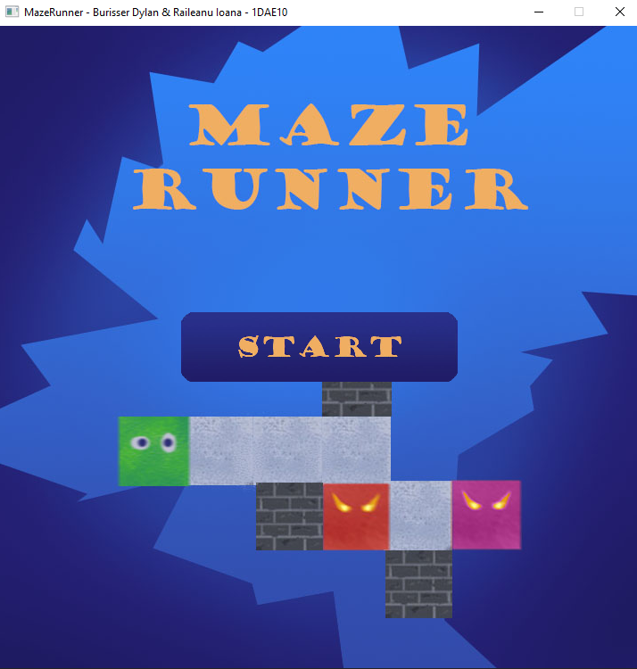
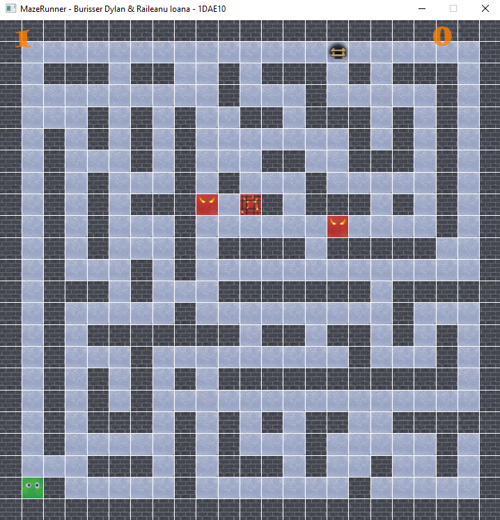
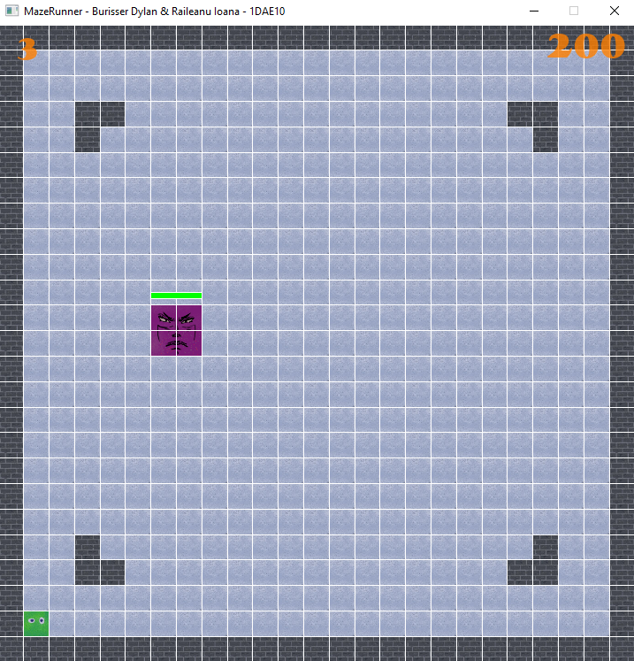
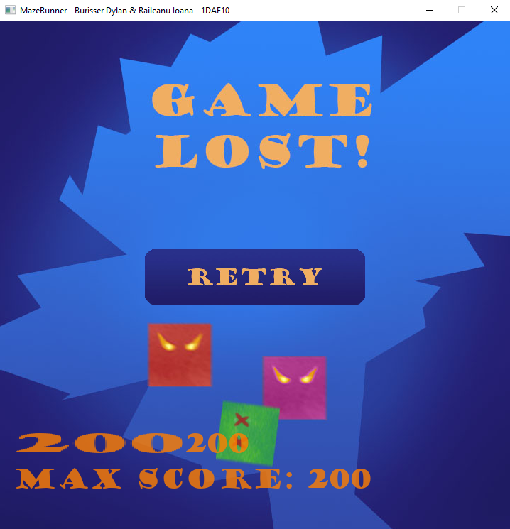

# 2D-Grid-Game Maze like game
It's a simple 2D grid game where you move through a maze to get the treasure at the end and score a maximum amount of points!

# Version 1.0
[Download](https://github.com/DijiOfficial/2D-Grid-Game/releases/tag/MazeRunner_v1.0) and Play Version 1.0 of MazeRunner by Raileanu Ioana and Burgisser Dylan

## The mission

- Build a maze from a 2D Array.
- Using the keyboard you can navigate in the maze (you can only stay on paths, you cannot cross walls)
- Get to the end before the end time and progress to the nex level.
- levels 1-3 are predifined but randomly generated after.
- levels get progressively more difficult with added ennemies and shooting mechanics? Coins and collectibles to collect as well as upgrades
- beautifull graphics
- second player?

Base game plan
  -> create a 2D array with the base level
  -> DrawMaze() function based on the array
  -> create a struct for the playable character 
  -> add the endPoint (in the 2D array maybe)
  -> add an enum class for the Direction
  -> implement the movement in the KeyDownEvent()
  -> cout "You won" message

Checklist
 - randomly generate the maze
 - generate the endPoint 
 - fix the enemy AI 
 - after reaching the endPoint ,generate new level
 - create the textures
 - add collision with the enemies (game lost titlescreen)
 - add a start screen

Extras
 - add a timer (difficulty setting) -> normal or hard (timed)
 - add 3 types of enemies with different speeds
 - add a way to kill/shoot the enemy 

